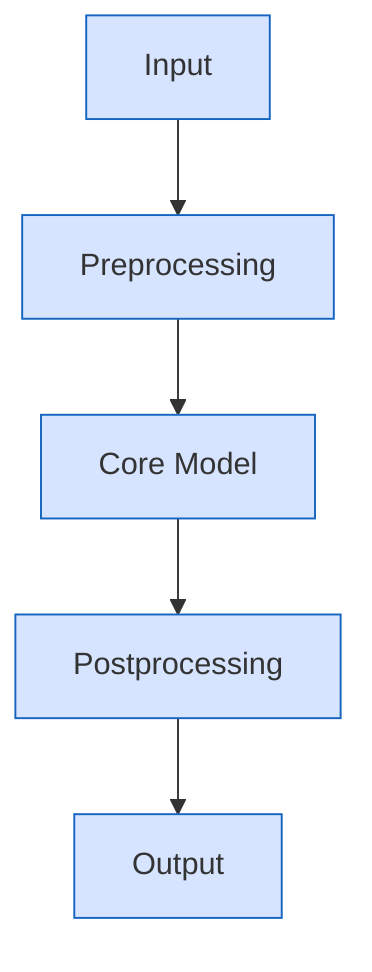

> [!abstract] Core Objective
> 2-4 sentences defining the document's goal, scope, and contribution boundaries. Avoid colloquialisms.

> [!info] Academic Writing Conventions
> 1. **Terminology consistency**: Core terms maintain unique naming; abbreviations explained on first use.
> 2. **Notation standards**: Symbols defined before use; formula and table numbering consistent.
> 3. **Citation style**: In-text use [n], end with reference list.

---

# 🟢 Bottom Logic (Logic)

## 1. Research Object & Problem Definition (Paragraphs)

Use academic paragraphs to clearly define research objects and core problems. Explain boundaries and assumptions. Should answer: what is the object, why important, under what conditions valid.

### 1.1 Concepts & Definitions (Paragraphs + Tables)

Provide strict definitions with precise semantic scope.

| Concept | Strict Definition | Notes |
| :--- | :--- | :--- |
| Concept A | Definition | Applicability bounds |
| Concept B | Definition | Common misconceptions |

### 1.2 Symbol Table (Table)

| Symbol | Meaning | Unit |
| :--- | :--- | :--- |
| $x$ | Variable | — |
| $\theta$ | Parameter | — |
| $\mathcal{D}$ | Dataset | — |

## 2. First Principles & Formalization (Paragraphs + Formulas)

Provide foundational principles and mathematical expressions explaining variable relationships.

$$
\mathcal{L}(\theta) = \sum_{i=1}^{n} \ell\big(f_{\theta}(x_i), y_i\big)
$$

Explanation: $\mathcal{L}$ is loss function, $f_{\theta}$ is model mapping, $\ell$ is sample-level loss.

### 2.1 Theoretical Propositions (Paragraphs)

> [!info] Proposition 1 (Example)
> Under assumptions H1-H3, objective function $\mathcal{L}(\theta)$ is convex.

## 3. Derivations & Boundary Conditions (Paragraphs + Formulas)

Provide key derivation steps. Avoid omitting "obviously" or "trivially". Specify boundaries and failure conditions.

$$
\nabla_{\theta} \mathcal{L}(\theta) = \sum_{i=1}^n \nabla_{\theta} \ell\big(f_{\theta}(x_i), y_i\big)
$$

### 3.1 Applicability & Failure Conditions (Table)

| Condition | Conclusion | Failure Reason |
| :--- | :--- | :--- |
| $x \to 0$ | Approximation holds | Numerical instability |
| $x \to \infty$ | Fails | Overflow / Overfitting |

---

# 🔵 Engineering Trade-offs (Engineering)

## 1. System Architecture (Paragraphs + Mermaid)

Explain module breakdown, data flow, and interface boundaries.



## 2. Algorithm Flow & Pseudocode (Paragraphs + Pseudocode)

```pseudo
function pipeline(x):
    x1 = preprocess(x)
    y  = model(x1)
    z  = postprocess(y)
    return z
```

## 3. Complexity & Performance (Table + Formulas)

| Module | Time Complexity | Space Complexity | Notes |
| :--- | :--- | :--- | :--- |
| Preprocessing | $O(n)$ | $O(n)$ | Linear scan |
| Model | $O(n\log n)$ | $O(n)$ | Main computation |

$$
T(n) = O(n\log n) + O(n)
$$

## 4. Engineering Failure Modes & Risks (Paragraphs + Table)

| Risk | Trigger | Consequence | Mitigation |
| :--- | :--- | :--- | :--- |
| Numerical instability | Gradient explosion | Training failure | Gradient clipping |
| Data drift | Distribution shift | Performance drop | Monitor & retrain |

---

# 🟣 Ecosystem Mapping (Context)

## 1. Literature & Standards Survey (Paragraphs + Citations)

Use paragraphs to overview research lineage and standards, with in-text citations [n].

- Representative work: Author/Year/Contribution [1]
- Standards or specs: RFC/Official docs [2]

## 2. Comparison with Adjacent Technologies (Table)

| Method | Advantages | Limitations | Use Cases |
| :--- | :--- | :--- | :--- |
| Method A | Pros | Cons | Scenarios |
| Method B | Pros | Cons | Scenarios |

## 3. Application Scenarios & Case Studies (Paragraphs + Table)

Describe application cases with data or metrics.

| Scenario | Metric | Result |
| :--- | :--- | :--- |
| Scenario A | Metric | Value |
| Scenario B | Metric | Value |

---

# 🔴 Deep Synthesis (Synthesis)

## 1. Interpretability & Reliability (Paragraphs)

Discuss model/system interpretability, reliability, and auditability. Point out existing shortcomings.

## 2. Ethics & Safety (Paragraphs + List)

- Data privacy and compliance
- Model bias and fairness
- Misuse and abuse risks

## 3. Open Questions (Paragraphs + List)

- Open question 1
- Open question 2
- Open question 3

---

# ✅ Quality Self-Check List

- [ ] Complete terminology definitions without ambiguity
- [ ] Symbol table consistent with formulas
- [ ] At least 1 Mermaid diagram
- [ ] At least 1 complexity or performance table
- [ ] Key conclusions have citation sources
- [ ] Failure conditions and boundaries fully explained

---

# References

[1] Authoritative paper / Official doc link
[2] Standard / Spec link

*Version: UNIFIED-STEM-SOP-V4.5-CCB*
